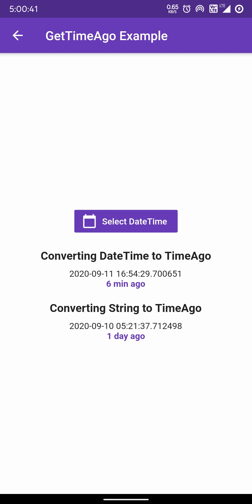

A new Flutter package for getting time formats in seconds, minutes, hours, days and date.

[](https://pub.dev/packages/get_time_ago)
[](https://pub.dev/packages/get_time_ago)

## Usage

```dart
import 'package:get_time_ago/get_time_ago.dart';
var _dateTime = DateTime.now();

var result = TimeAgo.getTimeAgo(_dateTime);
print(result);
```

If you have saved DateTime as string in database, then you can parse it as:

```dart
import 'package:get_time_ago/get_time_ago.dart';
// You can save abd fetch string type datetime as given format from any backend databases and set it to a variable, then parse this timestamp as given below steps:
var _timestamp = '2020-09-10 05:21:37.712498'; // String DateTime from backend.

var result = TimeAgo.getTimeAgo(DateTime.parse(_timestamp));
print(result);
```

## Output

<p>
 
 
 </p>    

     


